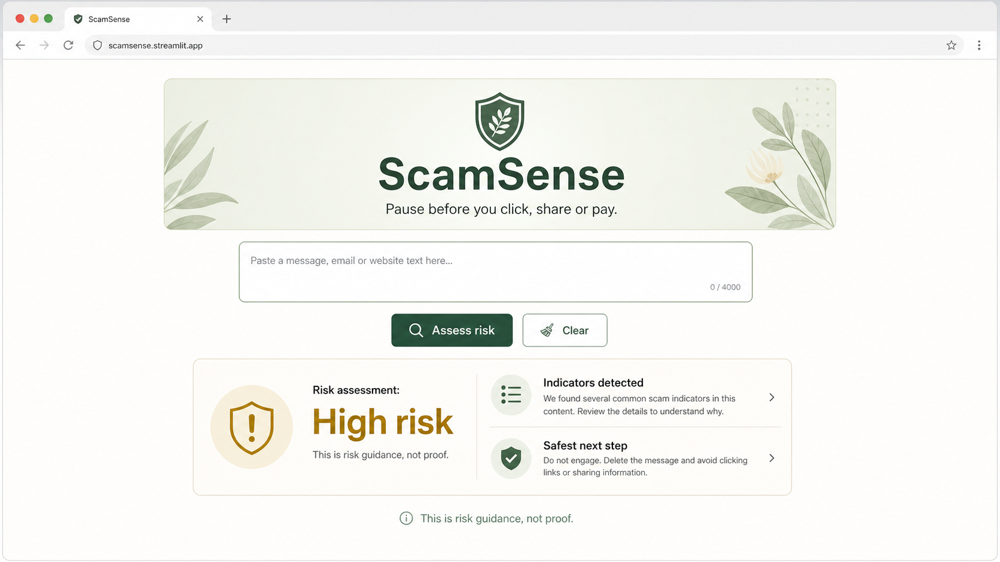

# ScamSense

ScamSense is a small, explainable scam-risk screening aid for suspicious messages. Paste an SMS, email or chat message and the app highlights observable warning signs, estimates a risk band, explains why those indicators matter and suggests a safer next step.

The v0.1 prototype is deliberately deterministic: no LLM, paid API, authentication, database, web scraping, link fetching or message history.

> **Live demo:** deployment-ready; add the assigned Streamlit Community Cloud URL here after deployment.



_Illustrative generated application preview. The checked-in Streamlit interface is the source of truth._

## Features

- Text input, clear action and ten opt-in fictional examples
- 17 documented scam-risk indicators with concise evidence and explanations
- Delivery, bank, marketplace, crypto, job, rental, family-emergency, tax/government and unknown contexts
- Transparent 0–100 scoring with documented low, medium, high and critical thresholds
- Text-labelled risk results, so meaning is not conveyed through colour alone
- Useful empty, lower-risk, ambiguous, suspicious and high-risk states
- Parent-friendly explanations and action-specific warnings
- Australian Scamwatch and cyber.gov.au reporting and recovery guidance
- Session-memory-only analysis with Streamlit usage telemetry disabled locally
- Deterministic engine and Streamlit interaction tests

## Run locally

ScamSense supports Python 3.11–3.14. Python 3.12 matches the deployment target.

```bash
cd scam-sense
python3.12 -m venv .venv
source .venv/bin/activate
python -m pip install -r requirements.txt
streamlit run app.py
```

Open the local URL printed by Streamlit. No secrets or API keys are required.

## Development checks

```bash
cd scam-sense
python -m pip install -r requirements-dev.txt
ruff format --check .
ruff check .
pytest
python scripts/smoke_streamlit.py
```

The smoke script starts the application from the repository root, matching Streamlit Community Cloud's working-directory behaviour.

## How the result is calculated

ScamSense normalises the message in memory, checks it against the versioned signal taxonomy, separately classifies its likely context, and then scores unique indicators using the documented weights:

| Indicator severity | Base score |
| --- | ---: |
| Low | 5 |
| Medium | 15 |
| High | 30 |
| Critical | 60, with a minimum final score of 80 |

Combined patterns—such as urgency plus payment pressure—add documented adjustments. Final bands are `0–19` lower risk, `20–49` medium risk, `50–79` high risk and `80–100` critical risk. The output exposes the indicators and adjustments instead of making an unexplained judgement.

See [risk-scoring-model.md](docs/risk-scoring-model.md), [signal-taxonomy.md](docs/signal-taxonomy.md) and [architecture.md](docs/architecture.md).

## Privacy and safety

ScamSense does not store a message history or send text to an analysis API. A hosted Streamlit app processes text in the host's session memory; users should remove personal information where practical and use a trusted HTTPS deployment.

ScamSense is an educational screening aid, not a guarantee. A lower-risk result does not prove a message is safe, and a high-risk result does not prove fraud. Independently verify unexpected requests through an official website, app or known contact path. Do not click suspicious links, disclose passwords or verification codes, or transfer money under pressure.

If money or sensitive details were shared, contact the relevant bank or provider immediately using official contact details. See the checked and dated [Australian safety and reporting guidance](docs/australian-guidance.md).

## Deployment

The application is configured for Streamlit Community Cloud with:

- entrypoint `scam-sense/app.py`
- Python 3.12
- dependency file `scam-sense/requirements.txt`
- no secrets

Follow [deployment.md](docs/deployment.md) for clean-environment verification and deployment steps.

## Project layout

```text
scam-sense/
├── app.py
├── src/scamsense/       # detector, classifier, scorer and guidance
├── tests/               # deterministic engine and Streamlit tests
├── data/samples/        # fictional planning examples
├── docs/                # safety, architecture and deployment sources
└── assets/              # public README preview
```

## Roadmap

- **v0.1:** deterministic rule-based screening prototype — complete
- **Next:** collect false-positive/false-negative feedback using fictional or redacted examples
- **Later:** consider additional languages and accessibility review
- **Optional research:** an explanation layer may be explored only if deterministic detection remains the source of truth and privacy/safety controls are preserved

## Limitations

- Rules can miss new, obfuscated or context-dependent scams.
- Legitimate messages can contain scam-like urgency, links or payment language.
- ScamSense does not inspect live URLs, attachments, senders, accounts, phone numbers or identities.
- Category classification is context, not proof.
- The fictional examples are test fixtures, not current scam intelligence.

## Disclaimer

ScamSense provides educational risk guidance only. It is not legal, financial, banking, cybersecurity, police or government advice and does not determine whether a message is definitely fraudulent or safe.
